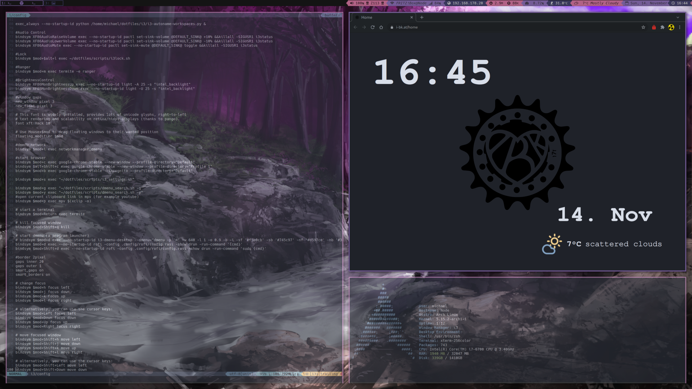

# Dotfiles
Dotfiles for my Arch installation
<p align="center">
	
</p>

## Installation
- clone the repository: `git clone https://github.com/mike7549/dotfiles`
- change to repository directory: `cd dotfiles`
- run: `sh scripts/installscript.sh`

## Configuration
- Download Files:
	- change permission: `chown user:group /path/to/downloads && chmod 1777 /path/to/downloads`
- Blacklist wlan:
	- add to /etc/modprobe.d/blacklist.conf: `blacklist ideapad_laptop`
- Refind manual boot stanzas:
	- Miix Notebook: 
	
	```
	Menuentry “Arch” {
		icon /EFI/refind/themes/rEFInd-minimal/icons/os_arch.png
		volume “Arch Linux”
		loader /vmlinuz-linux
		initrd /intel-ucode.img
		initrd /initramfs-linux.img
		options “rw root=UUID=... quiet vga=current loglevel=3 rd.systemd.show_status=auto rd.udev.log-priority=3 splash pcie_aspm=off”
	}

	menuentry “Windows” {
		icon /EFI/refind/themes/rEFInd-minimal/icons/os_win.png
		loader	\EFI\Microsoft\Boot\bootmgfw.efi
	}
	```
- Rename device name for pulse audio:
	- add to /etc/pulse/default.pa: `load-module module-device-manager`
	- in pavucontrol right click on the combo box widget next to port in in/output devices